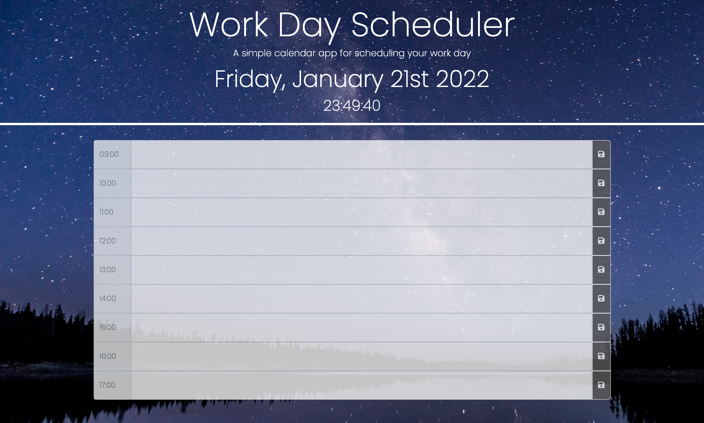

# Day-Planner

This application allows the user to store a daily schedule for use throughout the day. User input is saved in to local storage for the user to refer back to later. the color of the time blocks change based on the time of day, if the time block is in the past it is colored grey, if it is in the present it is colored red, and if it is in the future it is colored green. Finally the background image changes based on the time of day, to provide a more in depth user experience, and to enhance the time-keeping element of the application.

https://laurawalters1.github.io/Day-Planner/

https://github.com/laurawalters1/Day-Planner
